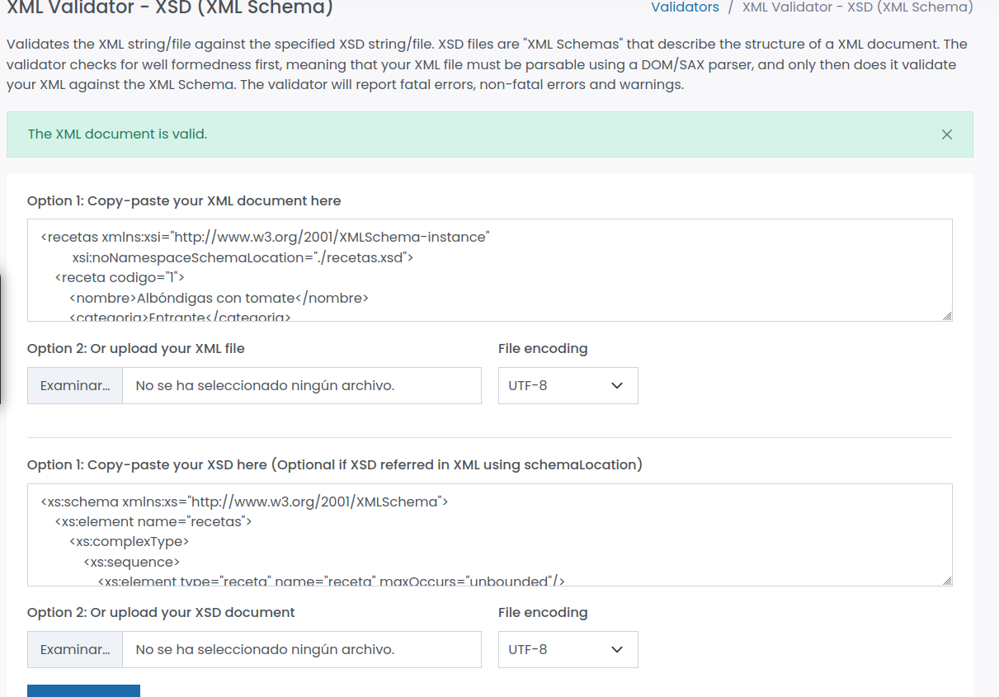

# Pregunta 1:

Para el desarrollo del archivo de validación del archivo recetas.xml (recetas.xsd) he utilizado WebStorm, el IDE por excelencia
para desarrollo de aplicaciones web, ya que gracias a todas las funcionalidades que implementa de forma nativa me ha facilitado el trabajo a la hora
de la creación del .xsd gracias a su interfaz amigable y soporte nativo para este tipo de archivos de validación.

# Evidencia de validación

# Para qué sirve DOMParser y en qué se diferencia a trabajar con JSON

DOMParser es el objeto nativo de JavaScript por excelencia el cual nos permite transformar un archivo XML a un JSON de forma muy directa,
ya que éste internamente divide el archivo XML en un árbol de nodos, de forma que puede recorrer de forma sencilla al igual que se hace en el DOM de una 
página HTML.

Cabe destacar también que DOMParser al ser un objeto nativo de JavaScript solo funciona en el entorno cliente, es decir, en el navegador,
a diferencia de otras librerías como xml2js que se ejecutan en el entorno servidor gracias a Node.js.

Por lo que gracias a este objeto podemos trabajar con JSON en proyectos más antiguos los cuales no usen el formato JSON por defecto,
facilitándonos el trabajo ya que hoy en día, JSON es el formato de intercambio de datos por excelencia en el entorno web gracias a su sencillez, 
liegereza, que está basado en texto y usa pares de clave-valor.